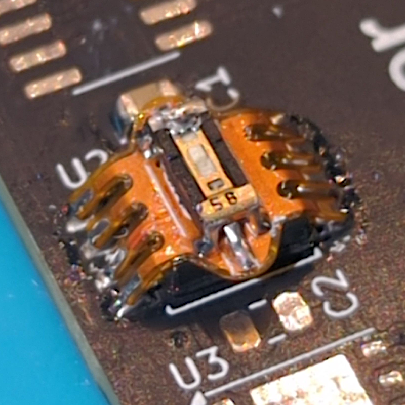

# Flashkeeper

## Manage and Protect your SPI Flash Chip!

[Documentation](https://flashkeeper.org) | [Source](https://git.15h.org/Flashkeeper/flashkeeper) | [Join us on Matrix!](https://matrix.to/#/#flashkeeper:matrix.org)

Flashkeeper is a family of open-hardware add-ons for standard SOIC-8 and WSON-8 SPI NOR flash chips (as are commonly used for firmware storage in PCs and other electronics), providing functionality for write-protection control, SPI bus breakout, flash device emulation, reprogramming, and state validation.

Flashkeeper development takes place on the [15h.org](https://15h.org) Git forge, and is mirrored to Github as a backup. If you wish to participate in Flashkeeper development on 15h.org infrastructure, please request an account in either the [Flashkeeper room](https://matrix.to/#/#flashkeeper:matrix.org) or the 15h.org room on Matrix. Issues may be opened on either 15h.org or Github.

For user information, please see the [documentation](https://flashkeeper.org). For hardware source files, see `hw/`.

The Flashkeeper project is supported by [NLnet NGI Zero Core](https://nlnet.nl/project/Flashkeeper/).

---
